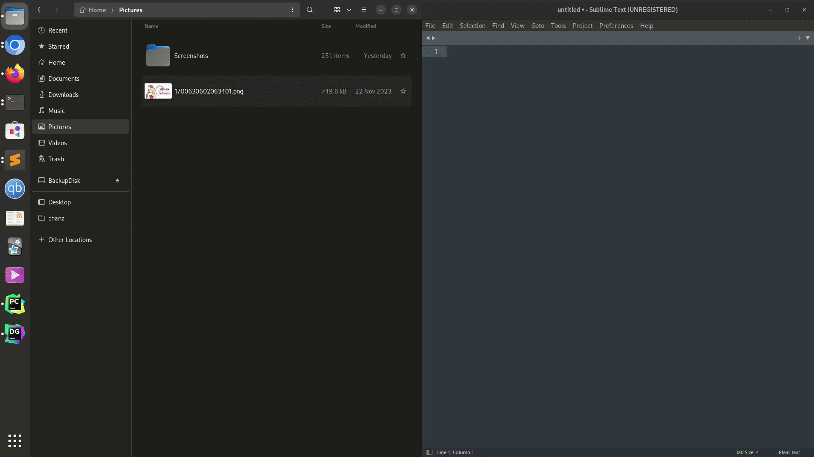

Nautilus extension that adds an option to the contextual menu to get the base64 of a file into your clipboard.

# Dependencies

```
sudo apt install python3-nautilus python3-gi xclip
pip install xerox
```

# Install

1. Get into nautilus scripts' directory
`cd ~/.local/share/nautilus-python/extensions #if the last two directories dont exist just create them`

2. Download the script
`wget whatever`

3. Make it executable
`chmod +x b64.py`
